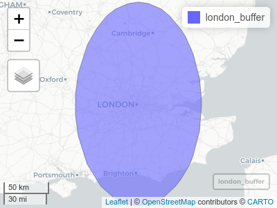
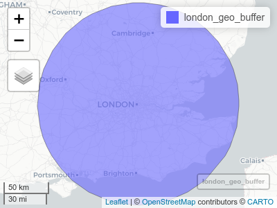

<!-- README.md is generated from README.Rmd. Please edit that file -->

# sfextras

<!-- badges: start -->

[](https://github.com/Robinlovelace/sfextras/actions)
<!-- badges: end -->

The goal of sfextras is to provide some extra functionality on top of
the `sf` package.

## Installation

You can install the development version from
[GitHub](https://github.com/) with:

<!-- the released version of sfextras from [CRAN](https://CRAN.R-project.org) with: -->
<!-- ``` r -->
<!-- install.packages("sfextras") -->
<!-- ``` -->

``` r
# install.packages("devtools")
devtools::install_github("Robinlovelace/sfextras")
```

## Example

This is a basic example which shows you how to solve a common problem:
how to create a buffer with geographic data (see [Chapter
6](https://geocompr.robinlovelace.net/reproj-geo-data.html#modifying-map-projections)
of Geocomputation with R for details):

``` r
library(sfextras)
```

    #> [1] TRUE

``` r
london_buffer = sf::st_buffer(london_geo, dist = 1)
#> Warning in st_buffer.sfc(st_geometry(x), dist, nQuadSegs, endCapStyle =
#> endCapStyle, : st_buffer does not correctly buffer longitude/latitude data
#> dist is assumed to be in decimal degrees (arc_degrees).
london_geo_buffer = geo_buffer(london_geo, 111000)
```


